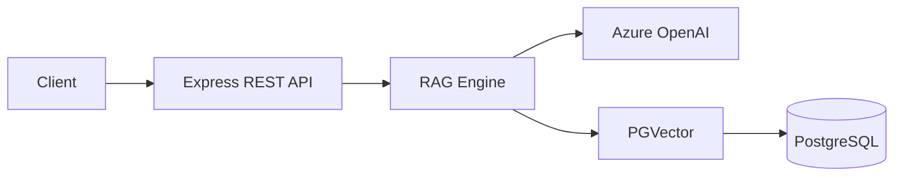
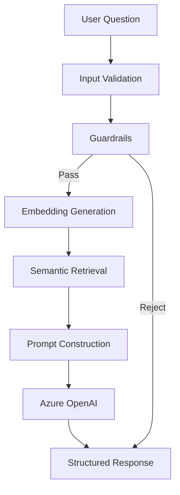
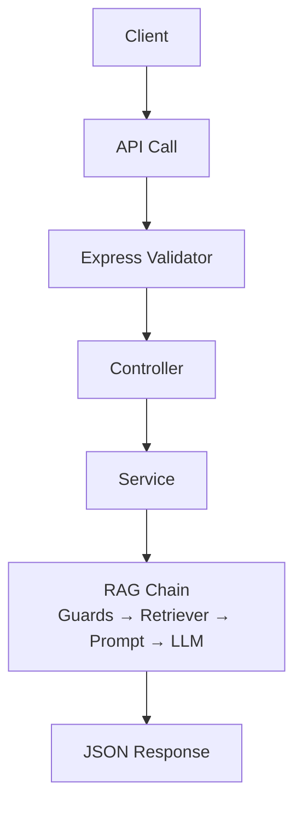
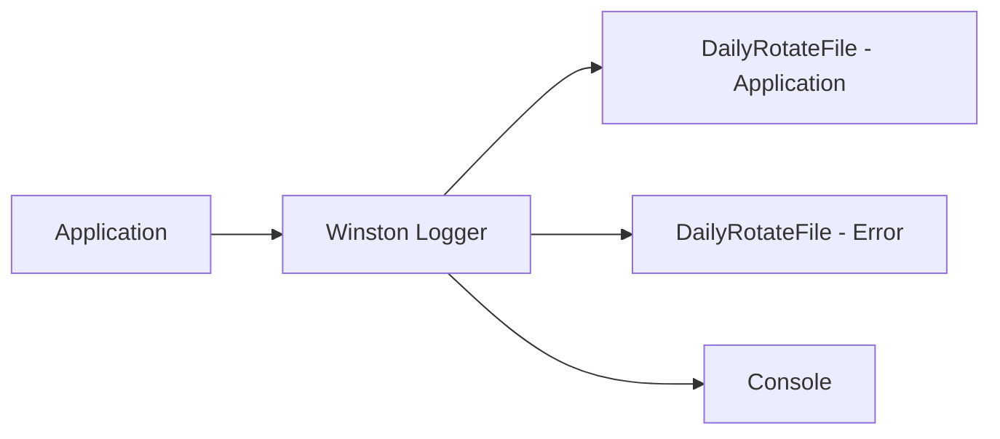

# Architecture

## Purpose

This document describes the high-level architecture of the Enterprise RAG Chatbot Backend. It is intended for software engineers, architects, DevOps engineers, and maintainers to understand how the system is structured, how its major components interact, and the design principles that guided its implementation.

## System Overview

The application is an Express.js backend that exposes REST APIs for chat, document ingestion, and health verification. It is organised around a Retrieval-Augmented Generation (RAG) pipeline that is composed using LangChain runnables. Incoming requests pass through route-level validation, then enter a guarded pipeline that retrieves relevant documents from a PGVector vector store, constructs a context-grounded prompt, and sends it to Azure OpenAI for a structured answer. All operations are logged via Winston with daily-rotating file transports.

## High-Level Architecture

## Core Components

### Express Server

Bootstraps the HTTP server on the configured port and registers SIGINT / SIGTERM handlers for graceful shutdown.

### REST API Layer

Express routes mounted under `/api/chat`, `/api/ingestion`, and `/api/health` — each with its own validation rules and controller.

### RAG Engine

A LangChain `RunnableSequence` that composes retrieval, guardrail branching, prompt construction, and structured LLM output into a single callable chain.

### Embedding Service

An `AzureOpenAIEmbeddings` client that generates vector embeddings for text. Configured with `maxRetries: 3` for resilience.

### Retrieval Service

Wraps the vector store as a LangChain `VectorStoreRetriever` with a default top-K of 5. The vector store provider is resolved by name from configuration.

### Prompt Builder

Assembles a RAG prompt by combining the user's question with a formatted context (source labels, chunk metadata, separator) and injecting them into the LangChain prompt template.

### Guardrails

Four `RunnableLambda`-based filters that short-circuit the pipeline:

- **Empty question** — rejects blank inputs
- **Greeting** — returns a predefined response without invoking the LLM
- **Instruction attack** — detects jailbreak / system-prompt manipulation patterns
- **No documents** — returns a low-confidence answer when the retriever returns nothing

### Vector Store

A PGVector-backed `documents` table with columns for `id`, `content`, `metadata`, and `embedding`. Similarity search uses cosine distance (`<=>` operator).

### Logging

Winston with three transports:

- `DailyRotateFile` — application log (all levels), `application-%DATE%.log`
- `DailyRotateFile` — error log (error level only), `error-%DATE%.log`
- `Console` — colourised output for development

## Data Stores

### PostgreSQL

The primary relational database. Stores vector-extension metadata, the `documents` table, and all ingested embeddings. Accessed through a connection pool configured by `DATABASE_URL` and `DB_POOL_MAX`.

### PGVector

The vector similarity-search extension within PostgreSQL. Enables cosine-distance queries against stored embeddings. Created via `CREATE EXTENSION vector` and verified at startup.

## RAG Processing Flow

Each stage is explained below:

1. **Input Validation** — express-validator checks the request body (`question` / `projectName`).
2. **Guardrails** — `isInvalidQuestion`, `isGreeting`, `isInstructionAttack`, `hasNoDocuments` run before the LLM is invoked.
3. **Embedding Generation** — The question is embedded via Azure OpenAI to enable vector search.
4. **Semantic Retrieval** — PGVector returns the top-K most similar document chunks.
5. **Prompt Construction** — Context and question are combined into a `ChatPromptTemplate`.
6. **Azure OpenAI** — The LLM returns a `Zod`-validated `{ answer, confidence }` object.
7. **Structured Response** — Source metadata and response-time metrics are attached before returning.

## Request Lifecycle

All errors propagate through the global `errorMiddleware` which logs the full stack trace and returns a consistent `{ success: false, message }` envelope.

## Logging Architecture

## Deployment Architecture

The application currently runs directly on a Ubuntu host with:

- `node` process managed by `nodemon` (development) or directly (production)
- PostgreSQL 16+ on the same host (or accessible via `DATABASE_URL`)
- No container orchestration

A Docker Compose setup is planned for future releases to bundle the application, database, and vector store into a single containerised environment.

## External Dependencies

| Dependency    | Purpose                                    |
|---------------|--------------------------------------------|
| Azure OpenAI | Embedding generation and structured answer production |
| PostgreSQL    | Document and vector metadata persistence  |
| PGVector      | Cosine similarity search over embeddings  |
| LangChain     | Runnable composition for the RAG pipeline  |
| Express       | HTTP server and route management           |
| Winston       | Application and error logging               |

## Architecture Principles

- **Separation of Concerns** — Routes, controllers, services, and chains each have a single responsibility.
- **Provider Pattern** — The vector store is resolved by a `provider` key in configuration, enabling future swaps.
- **Configuration-driven Architecture** — All credentials, ports, and feature flags are read from `.env`.
- **Enterprise Logging** — Every error is logged with stack trace, request method, URL, and timestamp.
- **Graceful Shutdown** — SIGINT / SIGTERM handlers close the pool and exit cleanly.
- **Single Responsibility** — Each `export` in a file does exactly one thing.

## Future Architecture

- Socket.IO real-time chat
- Conversation memory and session state
- User authentication and request authorisation
- Docker Compose for local development
- Token-by-token streaming responses
- Multi-tenant document isolation

